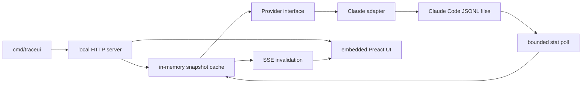

# Claude TraceUI extraction

Status: proposed

Work identity: ticketless

Target repository: `maestro-mini`

## Outcome

Maestro Mini ships a local, read-only TraceUI for native Claude Code sessions.
A user can clone the repository, run one Go command, and inspect root sessions,
subagent trees, token usage, timing, status, and conversation detail in a live
browser view.

The supported source is Claude Code CLI session history stored under the Claude
configuration directory. Other Claude applications become supported only when
their documented storage contract and fixtures satisfy this specification.

The extraction makes the existing session viewer portable across employers and
repositories. It carries one provider seam and one Claude Code implementation,
with no organization-specific runtime dependency.

## User experience

From a clean clone with Go installed, the user runs:

```sh
go run ./cmd/traceui
```

The command:

1. resolves the native session root;
2. scans the store synchronously;
3. listens on `127.0.0.1:7777` by default;
4. prints the browser URL and resolved session root; and
5. refreshes the view as Claude Code appends session records.

Root resolution follows this precedence:

1. `--root PATH`;
2. `$CLAUDE_CONFIG_DIR/projects` when `CLAUDE_CONFIG_DIR` is set; and
3. `$HOME/.claude/projects`.

`--addr` accepts a loopback host and port. Port `0` requests an available port
for tests and isolated runs. The process reports the actual listening address.

## Product surface

### Session view

The browser provides:

- root sessions ordered by recent activity;
- free-text filtering and status, duration, session-count, token, and model
  sorting;
- completed, active, aborted, malformed, and missing-child states;
- aggregate token usage across each root tree;
- an expandable parent/subagent waterfall; and
- per-node conversation detail with bounded transcript rendering.

The page uses the typed Preact frontend as the sole UI and serves it at `/`.
Compiled assets are embedded in the Go binary, so running TraceUI requires no
Node.js process.

### Local HTTP contract

The server exposes:

| Route | Purpose |
| --- | --- |
| `GET /` | Embedded TraceUI application |
| `GET /api/v1/sessions` | Cursor-paginated root summaries |
| `GET /api/v1/sessions/{id}/tree` | Provider-neutral session tree |
| `GET /api/v1/sessions/{id}/detail` | Derived detail and live bounded transcript |
| `GET /api/v1/events` | Server-sent invalidation events |

Responses retain a `provider` field with the value `claude`. This field belongs
to the provider-neutral contract and keeps the adapter seam explicit. The UI
has one source and therefore presents no provider selector.

The extracted contract uses portable `traceui.*` schema identifiers and
`traceui-*` browser-storage keys.

## Architecture



### Provider seam

The session package owns one interface covering the operations consumed by the
cache and server:

```go
type Provider interface {
    Name() string
    ListSessionFiles(root string) ([]string, error)
    ScanMeta(path string) (Meta, error)
    ParseFile(path string) (Record, error)
    Summarize(path string) (FileSummary, error)
    Transcript(path string) (TranscriptResult, error)
    MatchesSessionID(path, sessionID string) bool
}
```

`Claude` is the sole implementation. The command constructs it directly and
passes it with one root to the server. The server has one source, one owner for
every session identity, and one native status model.

### Claude Code projection

The adapter reads root JSONL files under each project directory and subagent
transcripts under `<session-id>/subagents/agent-*.jsonl`. It derives identity
from the native path, reconstructs parent-child relationships, sums native
usage counters, and bounds malformed input with contextual errors.

Native Claude records remain authoritative. Derived list and tree data lives
in memory and is rebuilt from those files. Conversation text is read from the
owning file for the detail response and remains outside derived persistence.
An unfinished session remains active for 15 minutes after the final timestamped
native record. When that activity lease expires, list, tree, and detail views
report it as aborted with `ended_at` set to that record's timestamp. An
unchanged poll makes this transition from cached metadata and emits a refresh
without rereading the JSONL file.
Claude Code may remove native files under its configured retention policy; the
next successful refresh reconciles the view to the surviving source files.

## Privacy and security

- TraceUI reads Claude Code session files and performs no mutation of them.
- The process emits no network request and binds to loopback addresses.
- List and tree responses carry derived metadata only.
- Detail responses contain native conversation text for local display.
- Transcript entries are bounded by entry count and rendered as text.
- One native line is capped at 4 MiB, one rendered entry at 64 KiB, the
  response at 200 entries split between its head and tail, and total rendered
  transcript text at 2 MiB. The response reports omitted entries.
- Errors include diagnostic path and record context while excluding prompt,
  reasoning, tool input, tool output, credentials, and message bodies.
- The application creates no session index, database, journal, or analytics
  file.

The documentation calls out that anyone with access to the local browser port
can read the displayed session content.

## Repository boundaries

This change adds:

- a root Go module and `cmd/traceui` executable;
- focused `internal/session` and `internal/traceui` packages;
- synthetic Claude fixtures and package tests;
- the typed frontend source, lockfile, and embedded build output;
- TraceUI documentation and validation gates; and
- concise TraceUI entries in the repository overview and source map.

The extraction leaves the existing agents, skills, heartbeats, command
expansions, and their install behavior intact.

The first release uses source distribution through the Maestro Mini repository.
Background services, durable databases, cloud sync, analytics, remote serving,
release binaries, package-manager installers, Jira integration, cross-provider
correlation, and additional provider implementations are later decisions.

## Acceptance basis

### Clean-clone operation

- `go run ./cmd/traceui` starts against the default Claude Code projects root.
- `go run ./cmd/traceui --root <fixture> --addr 127.0.0.1:0` reports a reachable
  URL and serves a populated first response.
- A missing or unreadable root exits with a contextual error, and a
  non-loopback `--addr` is rejected before listening.
- `go install ./cmd/traceui` produces a self-contained executable with embedded
  frontend assets.
- Runtime operation needs Go and a browser; frontend tool dependencies are
  build-time inputs.

### Session behavior

- Synthetic fixtures cover a root, completed and active subagents, a resumed
  root, pending work, malformed input, format drift, transcript bounds, and
  privacy-sensitive message bodies.
- The list, tree, and detail endpoints resolve root and child identities from
  the Claude store.
- Token totals equal the sum of available root and descendant usage.
- A native file append changes the in-memory snapshot, emits one invalidation,
  and updates every open resource in place.
- An unchanged poll performs no full reparse and emits an invalidation when an
  unfinished session's 15-minute activity lease expires.
- Stale unfinished sessions are aborted at the final native record timestamp
  consistently across list, tree, and detail responses, even when the source
  file has a recent modification time.
- A malformed file remains visible with a bounded diagnostic and cannot block
  healthy sessions from refreshing.
- Removing a native source file removes its session on the next successful
  refresh while surviving sessions remain available.

### UI behavior

- The initial document contains server-rendered session rows.
- Search, sort, expansion, waterfall selection, and transcript detail work on
  live fixture data.
- Refresh preserves the current filter, sort, expansion, and transcript scroll
  state.
- Session text enters the DOM through text rendering.
- The frontend contains no provider, heartbeat, telemetry, or A2A controls.

### Portability and verification

- Application code and generated assets contain no Gigabrain, Codex, OpenAI,
  GB Events, wide-event, or A2A runtime surface.
- Go tests, frontend type checking, linting, invariants, formatting checks,
  unit tests, and a reproducible asset build pass.
- `make validate` includes the existing package checks and the new TraceUI
  verification entry points.
- A clean worktree rebuild produces the tracked embedded assets without a diff.

## Authority

The current request authorizes these planning artifacts and their merge to
`main`. Implementation, publication pushes, tags, releases, and installation
on an employer-managed machine require their own applicable authority.

TraceUI reads only local paths selected by its user. Implementation work carries
no authority to read or copy real employer session content into fixtures,
reports, commits, or test output.

## Dependencies and irreversible seams

- Claude Code's native JSONL shape is an external, versionless input contract.
  Synthetic fixtures, drift tests, and the dated
  [Claude session storage contract](references/claude-session-storage.md) form
  the compatibility boundary.
- The HTTP response shapes and schema identifiers become the frontend/server
  seam. T1 locks them before full UI extraction.
- The embedded compiled frontend is a published artifact. Reproducible builds
  and source review gate every update.
- The public repository license and provenance must permit every extracted
  source and font asset.

## Blocked stop conditions

Implementation stops and returns evidence when:

- extracted code or assets lack confirmed publication rights;
- a real supported Claude Code record cannot be represented without persisting
  or logging sensitive content;
- the server cannot enforce loopback binding on a supported platform;
- the clean-clone command needs an undeclared runtime service; or
- deterministic frontend generation cannot reproduce the committed assets.

## Residual risks and decision mechanisms

| Risk | Mechanism |
| --- | --- |
| Claude Code changes its native format | Preserve unknown-record visibility, add a redacted synthetic fixture, and update the adapter contract deliberately. |
| Active/completed status is heuristic | Document the rule and test pending, local-command-only, interrupted, and completed endings. |
| Large stores delay the first scan | Measure a production-shaped synthetic store; optimize only after a recorded baseline identifies the bottleneck. |
| Conversation detail exposes sensitive text locally | Keep loopback-only serving, bounded rendering, explicit documentation, and metadata-only logs. |
| Frontend dependency drift breaks reproduction | Pin the lockfile and require a clean generated-asset diff check. |
| A future provider pressures the single-source model | Add it through a separately specified contract revision after a concrete use case exists. |
